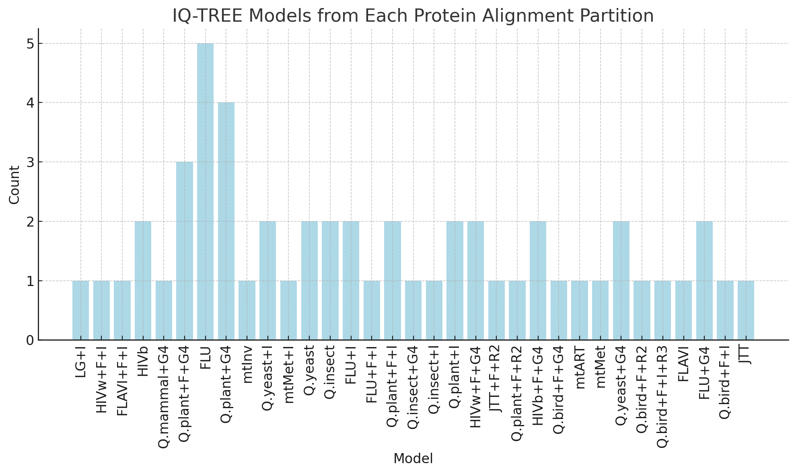

<!DOCTYPE html>
<html lang="en">
<head>
  <meta charset="UTF-8">
  <meta name="viewport" content="width=device-width, initial-scale=1.0">

</head>
<body>

<h1>IQ-TREE Phylogenetic Analysis Tutorial: Orthopoxvirus Species</h1>

<h2>1. Introduction</h2>

In this exercise, we will work with the complete proteomes of 13 Orthopoxvirus species, comparing different strategies for phylogenetic inference using IQ-TREE. The dataset includes protein alignments of single-copy genes across species. Our goal is to explore the impact of using a single general substitution model, a partitioned substitution model, and a partitioned-merged model approach on the robustness of our phylogenetic hypotheses.

<h3>Species and Accession Numbers</h3>
<table>
  <tr>
    <th>Species</th>
    <th>Accession Number</th>
  </tr>
    <tr><td><i>Vaccinia Duke</i></td><td>DQ439815</td></tr>
    <tr><td><i>Horsepox</i></td><td>DQ792504</td></tr>
    <tr><td><i>Ectromelia</i></td><td>JQ410350</td></tr>
    <tr><td><i>Variola</i></td><td>LR800244</td></tr>
    <tr><td><i>Vaccinia Mulford</i></td><td>MF477237</td></tr>
    <tr><td><i>Orthopoxvirus abatino</i></td><td>MH816996</td></tr>
    <tr><td><i>Camelpox</i></td><td>MK910851</td></tr>
    <tr><td><i>Buffalopox</i></td><td>MW883892</td></tr>
    <tr><td><i>Taterapox</i></td><td>NC_008291</td></tr>
    <tr><td><i>Raccoonpox</i></td><td>NC_027213</td></tr>
    <tr><td><i>Volepox</i></td><td>NC_031033</td></tr>
    <tr><td><i>Skunkpox</i></td><td>NC_031038</td></tr>
    <tr><td><i>Monkeypox</i></td><td>NC_063383</td></tr>
</table>

After downloading these proteomes from NCBI public database, we identified and extracted 53 complete single-copy proteins that were present in all species using OrthoFinder. We then created individual protein alignments with MAFFT and a concatenated alignment for IQ-TREE analyses.

 <strong>Note: Although this first part is not part of the assignment, I am including it in case anyone is interested in knowing how to generate these datasets. Also, the full data will be available in the data folder.
 </strong>

<h3>Identification and Extraction of Single-Copy Orthologous Proteins</h3>

<pre><code>orthofinder -f seqs  -o results </code></pre>

Explanation: This command runs OrthoFinder on protein sequences in the seqs folder and saves the output in a folder named results.

<li> -f seqs/: Specifies the input folder with proteome sequences. </li>
<li> -o results: Sets the output folder to results. </li>

 Here for more information about <a href="https://github.com/davidemms/OrthoFinder">Orthofinder</a> software.

<h3>Generating Individual Protein Alignments with MAFFT</h3>

The following script uses MAFFT to align each protein sequence file individually, optimizing for multiple threads to speed up the process:

<pre><code>for i in *.fasta
do
  mafft "$i" > "${i%.fasta}_aligned.fasta"
done
</code></pre>

Explanation:
<li> for i in *.fasta: Loops through each FASTA file in the directory.  </li>
<li> mafft "$i" > "${i%.fasta}_aligned.fasta": Uses MAFFT to align the sequences in each file ($i) and the aligned output for each file is saved with _aligned.fasta appended to its name </li>

<h2>2. Diversity of Substitution Models and Choosing the Optimal Model</h2>

<h3>DNA vs. Protein Models</h3>

In phylogenetics, substitution models describe the probability of mutations occurring at different sites within a sequence, capturing the evolutionary process more accurately. <strong>DNA models</strong> (like GTR and HKY) focus on nucleotide substitutions, where different rates can be assigned to transitions (e.g., A ↔ G) and transversions (e.g., A ↔ T). <strong>Protein models</strong> (like JTT and LG) are tailored to amino acid sequences, incorporating empirical data to account for the biochemical properties of amino acids, which affect how likely one amino acid is to replace another over time. These models are essential for generating more precise phylogenetic trees based on DNA or protein data.

<h3>Common Amino Acid (AA) Substitution Models in Phylogenetic Analysis</h3>

Various amino acid (AA) substitution models, such as BLOSUM, PAM, JTT, LG, and WAG, are commonly used. These models differ in their underlying data sources and the evolutionary assumptions they make, impacting how they fit specific protein datasets.

<h4>BLOSUM Model</h4>

The <strong>BLOSUM (BLOcks of Amino Acid Substitution Matrix)</strong> series is derived from comparisons of homologous protein sequences and is widely used in bioinformatics. Each BLOSUM matrix (e.g., BLOSUM62, BLOSUM80) is tailored to different levels of sequence similarity:

<ul>
  <li><strong>BLOSUM62</strong>: This matrix is based on sequences with approximately 62% identity, making it suitable for moderately conserved protein regions. It is commonly used for general protein alignment and is often a good choice for datasets with moderate sequence similarity.</li>
  <li><strong>BLOSUM80</strong>: Derived from highly similar sequences, BLOSUM80 is more appropriate for closely related proteins, capturing subtle substitution patterns among highly conserved amino acids.</li>
</ul>

In phylogenetics, BLOSUM matrices are often adapted into models that can capture specific substitution probabilities based on sequence conservation levels, making them versatile for various types of protein datasets.

<h4>Other Common Protein Models</h4>
<ul>
  <li><strong>PAM (Point Accepted Mutation) Series</strong>: Developed from observed mutations in closely related proteins, PAM matrices are tailored to high similarity datasets. For instance, PAM1 models minimal evolutionary divergence, while higher PAM numbers (e.g., PAM250) represent more distant relationships. PAM is often used for proteins with low to moderate divergence.</li>
  <li><strong>JTT (Jones-Taylor-Thornton)</strong>: This model is derived from a large set of protein sequences and is widely applicable to general protein data. It provides a balanced approach for datasets with a range of evolutionary divergences.</li>
  <li><strong>LG (Le and Gascuel)</strong>: The LG model is a newer, general-purpose model derived from a large protein alignment database. It is highly flexible and frequently used due to its robust fit across many datasets.</li>
  <li><strong>WAG (Whelan and Goldman)</strong>: Similar to JTT, the WAG model is based on a broad dataset of proteins and is suitable for datasets with various levels of evolutionary divergence.</li>
</ul>

<h3>Why Use Empirical Frequencies?</h3>

Amino acid substitution models are essential for capturing evolutionary patterns in proteins. Unlike nucleotide models, which work with only four bases, AA models manage the complexity of 20 amino acids, each with distinct biochemical properties and substitution behaviors. IQ-TREE supports a range of AA substitution models, including options that incorporate <strong>empirical frequencies</strong> derived from specific organisms or protein families, such as yeast and influenza, or PFAM database. Applying these empirical frequencies can improve the model's accuracy when analyzing datasets that share similarities with those used to generate these frequency data.

<ul>
  <li><strong>Organism-Specific Adaptations</strong>: Empirical models, like those derived from yeast or flu virus proteins, capture substitution patterns typical of those organisms. For example, yeast-based models reflect the evolutionary pressures and biochemical constraints in yeast proteins, potentially leading to more accurate trees for similar datasets.</li>
  <li><strong>Improved Model Fit</strong>: Empirical frequency models incorporate pre-calculated amino acid frequencies from large datasets, which can improve the likelihood and fit of the model when used with similar protein data. This is particularly useful when protein datasets align with the evolutionary history of the source of the empirical data.</li>
  <li><strong>Application to Specialized Data</strong>: In our exercise, some proteins aligned well with models like <code>FLU</code>,  <code>HIVb</code> or <code>YEAST</code>. Such models offer refined substitution matrices that account for specific selective pressures in these organisms, making them highly suitable for proteins from closely related taxa or functionally similar proteins.</li>
</ul>

<h3>Choosing the Optimal Model</h3>

IQ-TREE's ModelFinder enables automatic model selection by testing various models and calculating which one best fits the data using criteria like AIC or BIC. This tutorial includes examples of running ModelFinder for protein sequences only.

<h2>3. Exercise Overview</h2>

We'll use IQ-TREE to analyze the concatenated protein alignments under three approaches:

<ol>
  <li><strong>Single Substitution Model</strong>: Applies one substitution model to all sequences (concatenated sequences).</li>
  <li><strong>Partitioned Model</strong>: Uses the best model for each partition (protein) individually.</li>
  <li><strong>Partitioned-Merged Model (MFP+MERGE)</strong>: Merges partitions to find an optimal model fit.</li>
</ol>

<h2>4. IQ-TREE Commands and Analysis Steps</h2>

<h3>Step 1: Running IQ-TREE with a Single Substitution Model</h3>
<pre><code>iqtree -s concatenatedProt.fasta -st AA -bb 1000 -alrt 1000 -m TEST</code></pre>

Explanation: This command runs IQ-TREE on the alignment file <code>concatenatedProt.fasta</code>, specifying a AA dataset (<code>-st AA</code>). It tests various substitution models (<code>-m TEST</code>) to find the best fit for the whole alignment. The command also performs 1000 ultrafast bootstrap replicates (<code>-bb 1000</code>) and 1000 SH-like approximate likelihood ratio test replicates (<code>-alrt 1000</code>) to assess branch support.

<strong>Note:</strong> The output will include a phylogenetic tree file, which contains the inferred evolutionary relationships among sequences in <code>concatenatedProt.fasta</code>. The tree will be annotated with branch support values from both the ultrafast bootstrap and SH-like approximate likelihood ratio tests, providing a measure of confidence in each branch.

<h3>Step 2: Running IQ-TREE with Partitioned Model Using ModelFinder</h3>
<pre><code>iqtree -s protein_alignment.fasta -st AA -m TESTONLYNEW -AIC </code></pre>

Explanation: This command uses ModelFinder (<code>-m TESTONLYNEW</code>) to identify the best substitution model for each protein alignment (<code>-st AA</code>). The <code>-AIC</code> option specifies the Akaike Information Criterion (AIC) for model selection.

<strong>Note:</strong> This command focuses solely on model selection, not on phylogenetic tree inference.

After identifying the best model for each alignment, the next step is to generate the file required to build a partitioned model according to IQ-TREE specifications. For more details, see the <a href="http://www.iqtree.org/doc/Advanced-Tutorial">advanced tutorial</a>.

<pre><code>iqtree -p proteins_partitions.nex -bb 1000 -alrt 1000</code></pre>

<strong>Explanation:</strong> This command runs IQ-TREE using a partitioned model specified in the file <code>proteins_partitions.nex</code> (<code>-p</code> option). The Nexus file <code>proteins_partitions.nex</code> includes each protein alignment along with its respective substitution model, as identified in previous steps. IQ-TREE then applies these models to the specified partitions. Additionally, the command performs 1000 ultrafast bootstrap replicates (<code>-bb 1000</code>) and 1000 SH-like approximate likelihood ratio test replicates (<code>-alrt 1000</code>) to assess branch support.

<strong>Note:</strong> The output will include a single phylogenetic tree file that represents the inferred evolutionary relationships among the sequences defined in <code>proteins_partitions.nex</code>, with each partition analyzed using its optimal substitution model.

<h3>Step 3: Running IQ-TREE with a Partitioned-Merged Model (MFP+MERGE)</h3>
<pre><code>iqtree -p proteins_partitions.nex -bb 1000 -alrt 1000 -m MFP+MERGE</code></pre>

Explanation: This command applies the <code>MFP+MERGE</code> model selection strategy in IQ-TREE, where ModelFinder uses a greedy algorithm (Lanfear et al., 2012) to optimize the partitioning scheme. It starts with each gene as a separate partition (using the full partition model) and progressively merges genes with similar evolutionary rates until the model fit stops improving. This approach helps reduce over-partitioning, resulting in a more efficient model that balances fit and complexity.

<strong>Note:</strong> Running this command will produce a phylogenetic tree based on the optimized partition-merged model, which can improve accuracy by consolidating partitions with similar substitution rates.

<h2>5. Results Interpretation and Comparison</h2>

The distribution of substitution models selected by IQ-TREE across the protein alignment partitions shows a significant diversity, as seen in the image above. This wide variation in model selection suggests that different evolutionary pressures and substitution patterns are at play for each protein, which could reflect functional specialization or adaptation within the Orthopoxvirus genus. Such diversity in model choice indicates that a concatenated approach, which uses a single model for all proteins, may overlook these individual evolutionary signals.

This variation in substitution models has evolutionary implications when inferring a concatenated phylogeny. Using a single substitution model for the entire concatenated alignment might lead to biases or misrepresentations of evolutionary relationships. By contrast, partitioned or partitioned-merged models can more accurately capture the unique substitution patterns of each protein, potentially leading to a more reliable phylogenetic inference. Overall, the diversity of models underscores the importance of using partition-specific or empirically-informed models to enhance the robustness of phylogenetic hypotheses.

    

<h2>6. Additional Topic Focus: ModelFinder and Partition Merging</h2>

In this exercise, we focus on <strong>partition merging with ModelFinder</strong> to optimize tree topology. By using the MFP+MERGE option, we test if merging similar partitions maintains phylogenetic resolution while reducing the computational burden. This exercise highlights when and why partition merging can be advantageous in multi-protein datasets.

<h2>7. Resources and Suggested Readings</h2>
<ol>
  <li><strong>ModelFinder</strong>: Lanfear et al., 2012 – For details on model selection and partition merging in phylogenetics.</li>
  <li><strong>Bootstrap Resampling</strong>: Nei et al., 2001; Seo et al., 2005 – For insights on resampling strategies in phylogenetic analysis.</li>
</ol>

</body>
</html>
